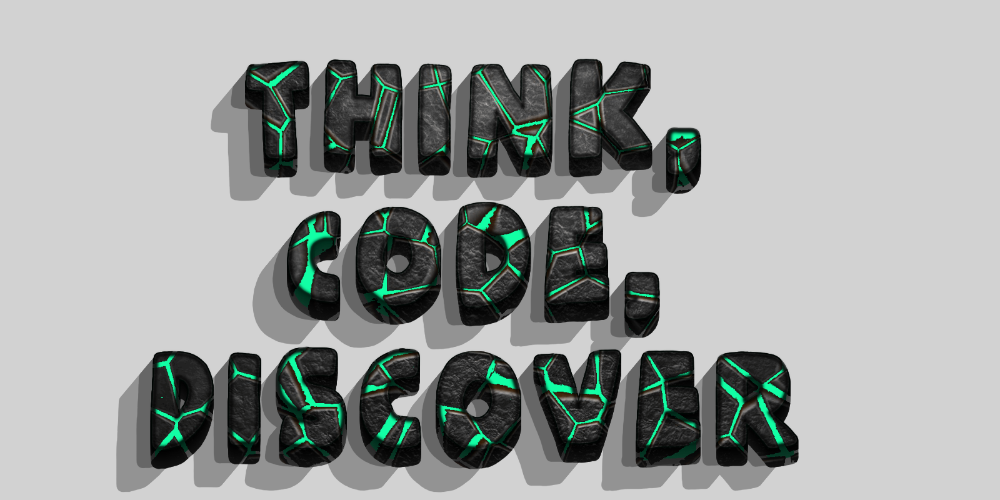

    <h1>Hello World </h1>
    

 
    <h5>
        Hi, I’m *Andrea* — a Computer Science student at the *University of Tor Vergata*. What fascinates me isn’t just writing code, but understanding the                 concepts that give it structure: **the theories behind programming languages, the logic that shapes computational thinking, and the mathematical ideas that         make these systems coherent and powerful**.
         
         
        I’m not the “follow the roadmap” type. I care about fundamentals. I spend a lot of time alone with problems because that’s where I think clearly — no               noise, no shortcuts, no rushing. Just me, the problem, and the drive to push it until the solution stops being merely acceptable and becomes logically              solid and genuinely efficient — the natural consequence of understanding.
         
         
        I don’t follow trends. I don’t solve things “the usual way.” If there’s a path everyone takes, I’ll probably check what’s beside it — the longer, quieter           route where thinking happens, where the best solution reveals itself as the one that fits the problem, not the one that’s fashionable.
        To me, computing is a living theory — a place where reasoning becomes creation. Every concept, from a basic function to an entire system, is a doorway into         understanding how human thought can be transformed into structured, executable logic.
         
         
        This mindset grew from a simple but essential question I asked myself when choosing this path: What ties all of this together?
        Hardware, programming languages, operating systems, networks, algorithms, logic, discrete math, probability, calculus, linear algebra — why are these the           foundations of Computer Science, and how do they connect?
         
         
        That question shaped my way of thinking. Now my focus is clear: to understand the theory behind everything as deeply as possible, because that’s what               separates a programmer from a computer scientist.
         
         
        That’s the path I’ve chosen — and the one I build every day.
    </h5>

  
 
 

    <h2 align="center">A bit more about me </h2>
    
    <h5 align="left"> - I'm interested in Data Analysis and Cybersecurity 📚</h5>
    <h5 align="left"> - I enjoy reading scientific articles. They serve as gateways to expanding my understanding of the world and the universe 🔭</h5>
    <h5 align="left"> - I enjoy playing videogames, but most of all, I really love reading news abut them, where I discover new trends, insights, and perspectives 🎮</h5>
    <h5 align="left"> - I'm a big fan of books. I love getting lost in them. It's like stepping into another world for a little while 💬 </h5>
    <h5 align="left"> - I love travelling around the world, and I can't wait to return in London that remains my cherished home away from home 🛫</h5>

 
 

    <h2>Summary card </h2></h2>
    <h5>Here's a summary card releted to my Github profile</h5>
    

 
 

    <h2>Contacts </h2>
    
    

