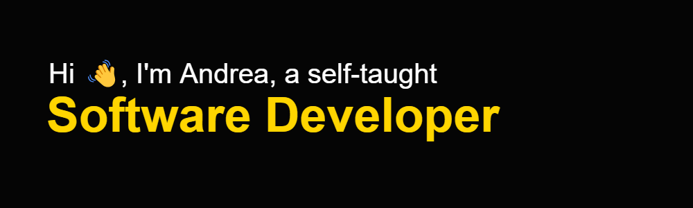
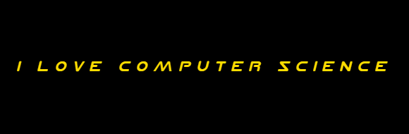

    <h1>Hello World </h1>
    

 
    <h5>
        Greeting from Rome, Italy! I'm Andrea, a self-taught software developer. 
        Thanks to my previous experience in London, UK, where I lived and worked, I figured out how studying is essential. It opened my eyes. I always believed that starting a formal university education was the sole path         to knowledge.
        Surrounded by London's vibrant diversity, I discovered the infinite possibilities of learning, not just through academic credentials but also through alternative paths that extend far beyond the classroom.                 Inspired by different people with different background around me, I embraced self-directed learning and embarked on a journey to complement my self-taught skills with industry-recognized certifications.
    </h5>
    <h5>
        Every line of code I write is a testament to my unwavering commitment to mastering this intricate art. Even though I don't have a bachelor's degree in computer science, my passion for this field is pushing me to           new heights. By immersing myself in a diversified academic pathway, venturing beyond programming to embrace computer science theory, mathematics, and physics, I'm gaining knowledge and skills that align perfectly          with the demands of the corporate world.
    </h5>
    <h5>
        I acknowledge that while academic credentials hold value, continuous learning and skill development are crucial for thriving in the dynamic tech industry. My commitment to this lifelong learning journey, fueled by         passion and determination, has been instrumental in my journey as a self-taught software developer. I am confident that my dedication, combined with my expanding knowledge and skills, will pave the way for a               successful career in this ever-evolving field.
    </h5>

  
 
 

    <h2 align="center">A bit more about me </h2>
    
    <h5 align="left"> - I'm a self-taught Software Developer that love spending time reading documentation and develop new ideas🧑‍💻</h5>
    <h5 align="left"> - I'm currently studying on Udacity and different academic books. They lay the foundation for my path as a software developer 🎓</h5>
    <h5 align="left"> - I'm looking to collaborate on different projects. So far I learned HTML, CSS, JS, and Python, but I'm continuously expanding my skillset 💻</h5>
    <h5 align="left"> - I'm interested in AI and Autonomous Systems. They ignite my passion for exploration and discovery as they present endless opportunities for learning and growth 📚</h5>
    <h5 align="left"> - I enjoy reading scientific articles. They serve as gateways to expanding my understanding of the world and the universe 🔭</h5>
    <h5 align="left"> - I enjoy playing videogames, but most of all, I really love reading news abut them, where I discover new trends, insights, and perspectives 🎮</h5>
    <h5 align="left"> - I'm a big fan of comic strips. I love getting lost in them. It's like stepping into another world for a little while 💬 </h5>
    <h5 align="left"> - I love travelling around the world, and I can't wait to return in London that remains my cherished home away from home 🛫</h5>
    <h4>And last but not least </h4>
    

 
 

    <h2>My dev card </h2>
    <h5>The following card represents how many and what types of articles I've read on DEV community. I'm trying to learn about different topics, 
        however, I really enjoy read articles related to software development, algorithms, cybersecurity, AI, computer architecture, math and physics.
    </h5>
          

 
 

    <h2>Summary card </h2></h2>
    <h5>Here's a summary card releted to my Github profile</h5>
    

 
 

    <h2></h2>
    <h5>Below I added my latest articles written on the Medium blog</h5>

 

    
     
     
    

 

    <h2>Contacts </h2>
    <ul>
        <li align="left">Email -> andreascacchi10@gmail.com </li>
       
        <li align="left">Medium -> <a target="_blank" href="https://medium.com/@ascacchi10">My Medium Profile </a></li>
    </ul>

